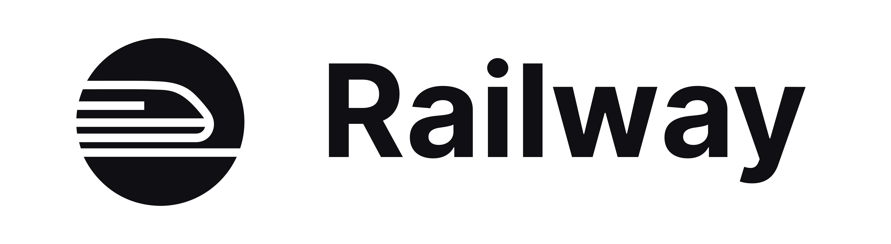

# Railway Promo

Promo Link: [https://railway.com?referralCode=kanban](https://railway.com/?referralCode=kanban)

Referral code: **`kanban`**

### How to use

1. Click the promo link above and create a Railway account.
2. Add the referral code **`kanban`** during signup if prompted.
3. Connect your GitHub repo or create a new project from a template.
4. Choose any managed add-on (database, Redis) to try with the provided credits.



***

### Highlights

* New-user credit: free credits for eligible new signups (see Railway terms).
* Fast deploys: connect a GitHub repo and deploy in minutes with automated builds and rollbacks.
* Managed services: try Managed Postgres, Redis, and popular plugins without setup overhead.
* Automatic scaling: scale services based on demand with minimal configuration.
* Integrations: CI/CD, environment variables, secrets management, and observability built-in.

***

### Affiliate disclosure

This is a referral link. If you sign up using the link above I may receive referral credit from Railway. The referral does not increase your cost.
