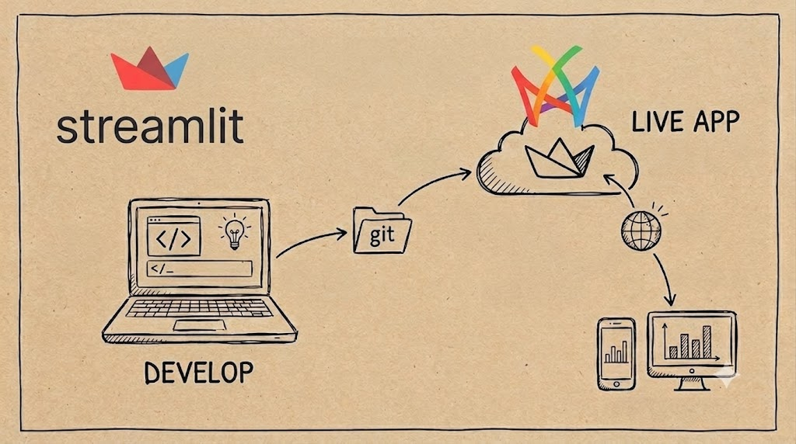

# Deploy a Streamlit App to Cloud in 5 Minutes

<figure><figcaption></figcaption></figure>

* **Streamlit** has become the go-to framework for data scientists and ML engineers who want to turn Python scripts into interactive web apps without touching HTML, CSS, or JavaScript. But building the app is only half the battle — deploying it so the world can see it? That’s where things usually get complicated.
* [**Railway**](https://railway.com/?referralCode=kanban) — a modern platform-as-a-service that takes your code, builds a container, and deploys it with a single click. No Dockerfiles to write, no Kubernetes YAML to wrestle with, no load balancer configuration needed.

I’ve created an open-source template that bridges these two worlds seamlessly: [**Streamlit on Railway**](https://github.com/markgzhou/railway-streamlit). In this post, I’ll walk through exactly how to use it.

***

### Why Railway for Streamlit? <a href="#why-railway-for-streamlit" id="why-railway-for-streamlit"></a>

There are plenty of ways to deploy a Streamlit app — Streamlit Community Cloud, Hugging Face Spaces, Render, Heroku, a bare VPS. Railway stands out for a few reasons:

* **One-click deploy from any GitHub repo** — connect your repo and Railway handles the rest
* **Automatic HTTPS** — every deployment gets a `your-app-name.railway.app` domain with TLS out of the box
* **Nixpacks-powered builds** — smart containerization that detects your language and dependencies automatically
* **Generous free tier** — $5 of starter credit with no time limit, plus a Hobby plan that’s great for side projects
* **Persistent volumes & private networking** — when your app needs a database or talks to internal services

The template repo takes all of this and adds production-ready configuration so your Streamlit app runs lean and fast.

***

### Deploy in 5 Minutes: Step-by-Step <a href="#deploy-in-5-minutes-step-by-step" id="deploy-in-5-minutes-step-by-step"></a>

#### Step 1 — Fork or clone the template <a href="#step-1--fork-or-clone-the-template" id="step-1--fork-or-clone-the-template"></a>

Go to [github.com/markgzhou/railway-streamlit](https://github.com/markgzhou/railway-streamlit) and click **Fork**.

#### Step 2 — Customize your app <a href="#step-2--customize-your-app" id="step-2--customize-your-app"></a>

Edit `main.py` with your own Streamlit code. Update `requirements.txt` with any additional Python packages your app needs.

Need a specific Python version? Edit `.python-version` — Railway respects it during the build.

#### Step 3 — Connect to Railway <a href="#step-3--connect-to-railway" id="step-3--connect-to-railway"></a>

1. Sign up at [railway.com](https://railway.com/?referralCode=kanban)
2. Click [](https://railway.com/deploy/SyDUOJ?referralCode=kanban)
3. Select your forked repository
4. Railway auto-detects the Nixpacks configuration and deploys immediately

That’s it. No `Dockerfile`, no `docker-compose.yml`, no CI/CD pipeline to configure. Railway watches your `main` branch and redeploys automatically on every push.

#### Step 4 — Share your app <a href="#step-4--share-your-app" id="step-4--share-your-app"></a>

Railway generates a public URL like `https://your-app-name.railway.app`. You can also add a custom domain from the project settings.

### What’s in the Box <a href="#whats-in-the-box" id="whats-in-the-box"></a>

The repository is intentionally minimal — just five meaningful files:

```
railway-streamlit/├── .python-version      # Pins Python 3.13├── nixpacks.toml        # Railway build & start configuration├── requirements.txt     # streamlit~=1.45.0├── main.py              # Your Streamlit application└── README.md
```

#### `main.py` — the heart of the app <a href="#mainpy--the-heart-of-the-app" id="mainpy--the-heart-of-the-app"></a>

```
import streamlit as st
st.title("Hello Streamlit-er 🎋")st.markdown(    """    This is a demo for you to try Streamlit on Railway and have fun.
    **There's :rainbow[so much] you can build!**
    We prepared a few examples for you to get started. Just    click on the buttons above and discover what you can do    with Streamlit.    """)if st.button("Send balloons!"):    st.balloons()
```

A friendly, working demo that you replace with your own code.

#### `nixpacks.toml` — the deployment spec <a href="#nixpackstoml--the-deployment-spec" id="nixpackstoml--the-deployment-spec"></a>

This is where the magic happens. The start command is tuned for production:

```
[start]cmd = "streamlit run main.py --server.address 0.0.0.0 --server.port 8080 \  --client.showErrorDetails false \  --server.fileWatcherType none \  --browser.gatherUsageStats false \  --client.toolbarMode minimal"
```

Let’s break down each flag:

| Flag                               | What it does                                                                           |
| ---------------------------------- | -------------------------------------------------------------------------------------- |
| `--server.address 0.0.0.0`         | Binds to all network interfaces so Railway’s router can reach it                       |
| `--server.port 8080`               | Uses port 8080 (Railway’s default exposed port via Nixpacks)                           |
| `--client.showErrorDetails false`  | Hides tracebacks from end users in production                                          |
| `--server.fileWatcherType none`    | Disables hot-reload watcher — saves CPU and memory since files won’t change at runtime |
| `--browser.gatherUsageStats false` | Opts out of telemetry                                                                  |
| `--client.toolbarMode minimal`     | Strips the Streamlit toolbar to a hamburger menu for a cleaner UI                      |

These seemingly small tweaks make your deployment production-grade: no unnecessary CPU cycles, no leaked debug info, and a polished user experience.

***

### Advanced Customization <a href="#advanced-customization" id="advanced-customization"></a>

#### Adding environment variables <a href="#adding-environment-variables" id="adding-environment-variables"></a>

Railway has a built-in secrets manager. Add environment variables in your project dashboard and access them in Streamlit via `os.getenv()` or `st.secrets`.

#### Adding a database <a href="#adding-a-database" id="adding-a-database"></a>

Railway offers one-click PostgreSQL, MySQL, Redis, and MongoDB. Add a database service to your project, and Railway injects the connection string as an environment variable automatically.

#### Scaling <a href="#scaling" id="scaling"></a>

The Hobby plan lets you adjust vCPU and RAM per service. Streamlit is single-session by default, so for multi-user scenarios, you’ll want to bump the resources or explore Streamlit’s experimental multi-page session support.

***

### Local Development <a href="#local-development" id="local-development"></a>

The workflow doesn’t change:

```
pip install -r requirements.txtstreamlit run main.py
```

The same `main.py` runs identically on your laptop and in the cloud — no environment divergence, no “it works on my machine” surprises.

***

### Performance Notes <a href="#performance-notes" id="performance-notes"></a>

The template prioritizes efficiency:

* **No file watcher** — In a containerized deployment, there’s nothing to watch. Disabling it saves \~10-20% idle CPU.
* **No telemetry** — Every network call in a container adds latency and cost. Telemetry is opt-out explicitly.
* **Minimal toolbar** — Less JavaScript rendering = faster page loads and less bandwidth.

These optimizations are especially important on the free/Hobby tiers where resources are constrained. Every megabyte of RAM and millisecond of CPU you save translates directly to better user experience.

***

### Conclusion <a href="#conclusion" id="conclusion"></a>

**Streamlit + Railway** is a powerful combination for data teams that want to go from idea to deployed app in minutes, not days. The template at [github.com/markgzhou/railway-streamlit](https://github.com/markgzhou/railway-streamlit) gives you a production starting point with sensible defaults — fork it, drop in your code, and ship.

This is the deployment experience data scientists deserve: no DevOps knowledge required, no infrastructure decisions to agonize over, just `git push` and your app is live.
